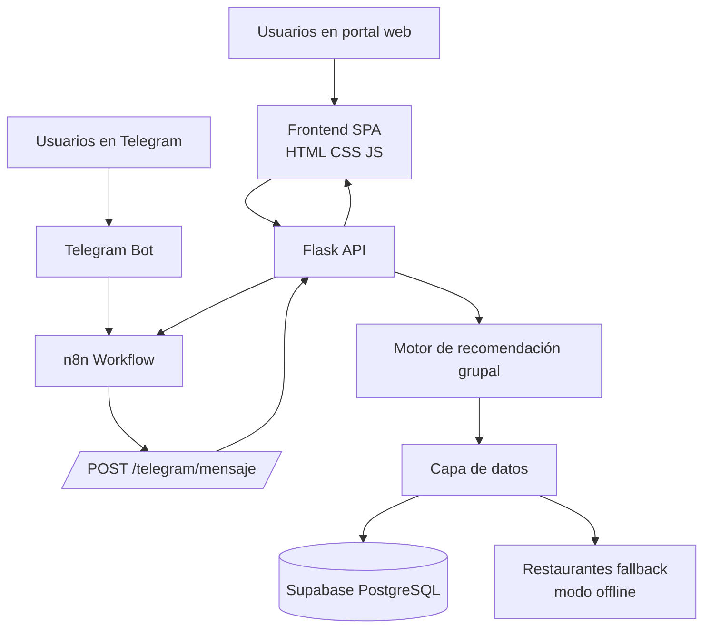

# ¿Dónde comemos hoy?

Sistema de recomendación grupal para decidir restaurantes en Cali, diseñado para transformar una fricción social cotidiana —“¿dónde comemos hoy?”— en una decisión más justa, explícita y negociada entre varias personas.

La aplicación combina un **portal web SPA**, una **API REST en Flask**, un **motor de recomendación grupal en Python**, persistencia en **Supabase PostgreSQL**, integración con **Telegram mediante n8n** y una suite de pruebas automatizadas para validar el comportamiento del sistema.

**Behance:**

---

## Tabla de contenidos

1. [Resumen del proyecto](#resumen-del-proyecto)
2. [Problema sociotécnico](#problema-sociotécnico)
3. [Qué hace la aplicación](#qué-hace-la-aplicación)
4. [Arquitectura general](#arquitectura-general)
5. [Estructura del repositorio](#estructura-del-repositorio)
6. [Modelo de recomendación](#modelo-de-recomendación)
7. [Métodos de agregación grupal](#métodos-de-agregación-grupal)
8. [Flujo del portal web](#flujo-del-portal-web)
9. [Flujo del bot de Telegram](#flujo-del-bot-de-telegram)
10. [Persistencia en Supabase](#persistencia-en-supabase)
11. [API REST](#api-rest)
12. [Instalación local](#instalación-local)
13. [Configuración de variables de entorno](#configuración-de-variables-de-entorno)
14. [Ejecución del proyecto](#ejecución-del-proyecto)
15. [Carga de restaurantes en Supabase](#carga-de-restaurantes-en-supabase)
16. [Integración con n8n y Telegram](#integración-con-n8n-y-telegram)
17. [Pruebas automatizadas](#pruebas-automatizadas)
18. [Validación con usuarios](#validación-con-usuarios)
19. [Despliegue en Render](#despliegue-en-render)
20. [Estado actual, hallazgos y pendientes](#estado-actual-hallazgos-y-pendientes)
21. [Relación con la rúbrica académica](#relación-con-la-rúbrica-académica)
22. [Roadmap sugerido](#roadmap-sugerido)

---

## Resumen del proyecto

**¿Dónde comemos hoy?** es una aplicación que recomienda restaurantes para grupos. En lugar de dejar que decida la persona más insistente, el sistema permite que cada integrante registre sus preferencias individuales y luego calcula una recomendación que intenta representar al grupo completo.

Cada persona indica, en escala de 1 a 10, qué tan importante son para ella cinco dimensiones gastronómicas:

| Dimensión | Significado |
|---|---|
| `picante` | Afinidad por comidas picantes o intensas |
| `dulce` | Preferencia por sabores dulces |
| `salado` | Preferencia por comidas saladas, sazonadas o intensas |
| `vegetariano` | Importancia de opciones vegetarianas |
| `carne` | Afinidad por platos con carne |

Además de estas cinco dimensiones, cada integrante puede indicar:

- Nombre.
- Presupuesto máximo por persona.
- Restricciones alimentarias.
- Peso de voto, usado por el método de mayoría ponderada.

El sistema compara el perfil agregado del grupo contra una base de restaurantes de Cali, usando **similitud coseno**, y devuelve un ranking de restaurantes con:

- Score de compatibilidad grupal.
- Score mínimo de satisfacción.
- Score promedio de satisfacción.
- Satisfacción por persona.
- Justificación textual de la recomendación.
- Advertencias si hubo filtros estrictos o fallbacks.

---

## Problema sociotécnico

La decisión grupal de dónde comer parece simple, pero suele generar tensión por tres razones principales:

1. **Asimetría de preferencias**  
   Algunas personas expresan sus gustos con más fuerza que otras. Sin una estructura neutral, las preferencias silenciosas pueden quedar invisibilizadas.

2. **Dominancia social**  
   En grupos, la decisión no siempre representa el gusto colectivo, sino la voz más insistente o la persona que decide más rápido.

3. **Falta de memoria de justicia**  
   El grupo no suele recordar quién cedió la última vez. Esto puede hacer que las mismas personas terminen sacrificando sus preferencias repetidamente.

El proyecto propone un sistema de recomendación como “árbitro neutral”: recoge preferencias individuales, las agrega con diferentes criterios y produce recomendaciones explicables para el grupo.

---

## Qué hace la aplicación

La aplicación permite:

- Crear un grupo de una o varias personas.
- Registrar preferencias gastronómicas individuales.
- Registrar presupuesto máximo por persona.
- Registrar restricciones alimentarias.
- Comparar el grupo contra una base de restaurantes.
- Elegir entre varios métodos de agregación grupal.
- Generar recomendaciones ordenadas por compatibilidad.
- Ver satisfacción mínima y satisfacción por persona.
- Comparar distintos métodos de recomendación para reflexión crítica.
- Guardar sesiones, usuarios, grupos, perfiles, recomendaciones y feedback en Supabase.
- Usar el sistema desde dos canales:
  - Portal web.
  - Bot de Telegram conectado mediante n8n.

---

## Arquitectura general



### Componentes

| Componente | Tecnología | Responsabilidad |
|---|---|---|
| Frontend web | HTML, CSS, JavaScript | Captura perfiles, muestra resultados, compara métodos y permite feedback |
| API REST | Flask | Expone endpoints para recomendación, comparación, feedback, restaurantes y healthcheck |
| Motor de recomendación | Python + NumPy | Implementa similitud coseno, filtros y métodos de agregación |
| Persistencia | Supabase PostgreSQL | Guarda usuarios, grupos, perfiles, recomendaciones, sesiones y feedback |
| Bot conversacional | Telegram + n8n | Canal secuencial para capturar datos del grupo y devolver recomendaciones |
| Deploy | Render + Gunicorn | Ejecución pública del servidor Flask |

---

## Estructura del repositorio

```txt
donde-comemos-hoy/
├── app.py
├── requirements.txt
├── render.yaml
├── seed_restaurantes_cali.py
├── FIX_SUPABASE.md
├── FRONTEND_README.md
├── .gitignore
│
├── api/
│   ├── servidor.py
│   └── telegram_handler.py
│
├── core/
│   └── motor_recomendacion.py
│
├── data/
│   └── base_datos.py
│
├── frontend/
│   ├── index.html
│   ├── script.js
│   └── styles.css
│
├── scripts/
│   └── n8n_webhook.md
│
└── tests/
    └── test_sistema.py
```

### Archivos principales

| Archivo | Descripción |
|---|---|
| `app.py` | Punto de entrada principal. Importa la app Flask desde `api/servidor.py` y registra el blueprint del bot de Telegram. |
| `api/servidor.py` | API REST principal y servidor del frontend estático. |
| `api/telegram_handler.py` | Máquina de estados del bot de Telegram. Procesa mensajes, registra integrantes, confirma grupo, recomienda y recibe feedback. |
| `core/motor_recomendacion.py` | Núcleo matemático del sistema. Contiene estructuras de datos, similitud coseno, filtros, métodos M1-M5 y motor principal. |
| `data/base_datos.py` | Capa de persistencia con Supabase. También contiene restaurantes fallback para modo offline. |
| `frontend/index.html` | Estructura del portal web. |
| `frontend/script.js` | Lógica del portal: estado del grupo, sliders, llamadas a la API, render de resultados, comparación y feedback. |
| `frontend/styles.css` | Estilos visuales del portal. |
| `scripts/n8n_webhook.md` | Guía para conectar Telegram con Flask usando n8n. |
| `seed_restaurantes_cali.py` | Script para poblar Supabase con restaurantes de Cali. |
| `tests/test_sistema.py` | Suite de pruebas unitarias, métricas, escenarios y tablas comparativas. |
| `render.yaml` | Configuración de despliegue en Render. |
| `FIX_SUPABASE.md` | Documento con cambios aplicados para persistencia y feedback. |
| `FRONTEND_README.md` | Documento específico del frontend. |

---

## Modelo de recomendación

### Representación vectorial

Cada usuario y cada restaurante se representan como vectores de cinco dimensiones:

```python
DIMS = ["picante", "dulce", "salado", "vegetariano", "carne"]
```

Ejemplo de usuario:

```json
{
  "nombre": "Camila",
  "vector": [3, 7, 6, 9, 2],
  "presupuesto_max": 28000,
  "distancia_max": 2000,
  "restricciones": ["vegetariano"],
  "peso_voto": 1.0
}
```

Ejemplo conceptual de restaurante:

```json
{
  "nombre": "Verde Vital",
  "vector": [2, 5, 5, 10, 1],
  "precio_promedio_cop": 22000,
  "tipo_cocina": ["vegana", "saludable"],
  "tiene_vegetariano": true,
  "tiene_vegano": true
}
```

### Similitud coseno

El motor usa similitud coseno para medir qué tan alineado está el perfil del grupo con cada restaurante.

La similitud coseno compara la dirección de dos vectores, no su magnitud absoluta. Esto es útil en preferencias subjetivas porque dos personas pueden usar escalas distintas pero mantener proporciones similares.

```txt
cos(A, B) = (A · B) / (||A|| · ||B||)
```

En el código, la función principal es:

```python
def similitud_coseno(a: list, b: list) -> float:
    a, b = np.array(a, dtype=float), np.array(b, dtype=float)
    norma_a = np.linalg.norm(a)
    norma_b = np.linalg.norm(b)
    if norma_a == 0 or norma_b == 0:
        return 0.0
    return float(np.dot(a, b) / (norma_a * norma_b))
```

### Filtros duros antes del ranking

Antes de recomendar, el sistema filtra restaurantes según:

1. **Presupuesto mínimo del grupo**  
   Se toma el presupuesto más restrictivo entre todos los integrantes.

2. **Restricciones alimentarias**  
   Se unen todas las restricciones del grupo y se eliminan los restaurantes que no las cumplen.

3. **Fallback**  
   Si ningún restaurante cumple todas las condiciones, se relaja la búsqueda y se generan advertencias.

---

## Métodos de agregación grupal

El punto central del proyecto es que no existe una única forma “correcta” de representar a un grupo. Cada método de agregación expresa una filosofía distinta de decisión colectiva.

| ID | Método en código | Nombre | Filosofía | Comportamiento |
|---|---|---|---|---|
| M1 | `promedio` / `m1_promedio` | Promedio naive | “Todos pesan igual” | Promedia todos los vectores. Siempre produce resultado, pero puede suavizar preferencias fuertes. |
| M2 | `minima_miseria` / `m2_minima_miseria` | Least misery | “Que nadie quede demasiado insatisfecho” | Solo activa dimensiones donde todos superan un umbral mínimo. Protege al menos satisfecho. |
| M3 | `maximo_placer` / `m3_maximo_placer` | Max pleasure | “Solo lo que todos aman” | Solo activa dimensiones donde todos tienen preferencias altas. Es restrictivo y puede producir vectores casi vacíos. |
| M4 | `media_satisfaccion` / `m4_media_satisfaccion` | Consenso real | “Solo donde hay acuerdo” | Activa dimensiones con baja desviación estándar. Busca alineación real, no solo promedio. |
| M5 | `mayoria_ponderada` / `m5_mayoria_ponderada` | Mayoría ponderada | “Quien ha cedido más puede pesar más” | Usa pesos de voto, umbral y mayoría del 60%. Si el grupo es muy diverso, cae a promedio ponderado. |

### M1 - Promedio

```python
perfil_n = promedio(vectores_del_grupo)
```

Ventajas:

- Simple.
- Fácil de explicar.
- Siempre devuelve un perfil de grupo.

Limitaciones:

- Puede ocultar conflictos fuertes.
- Puede recomendar opciones “intermedias” que no entusiasman a nadie.

### M2 - Mínima miseria

Solo conserva dimensiones donde todos superan un umbral mínimo.

Ejemplo: si alguien no tolera picante, la dimensión de picante se penaliza, aunque al resto le guste.

Ventajas:

- Protege a quien podría quedar peor.
- Es útil con restricciones alimentarias.

Limitaciones:

- Puede ser demasiado conservador.
- Puede generar perfiles con muchas dimensiones en cero.

### M3 - Máximo placer

Solo conserva dimensiones donde todos tienen una preferencia alta.

Ventajas:

- Busca placer compartido.
- Sirve para grupos muy alineados.

Limitaciones:

- Es el método más restrictivo.
- En grupos diversos puede quedarse sin información útil.

### M4 - Media satisfacción / consenso real

Usa la desviación estándar para detectar dimensiones donde el grupo realmente está alineado.

Ventajas:

- No se queda solo con el promedio.
- Identifica acuerdos reales.

Limitaciones:

- Puede ignorar dimensiones importantes si hay desacuerdo alto.
- Requiere explicar qué significa la desviación estándar en una interfaz amigable.

### M5 - Mayoría ponderada

Método propio del proyecto.

Combina:

- Promedio ponderado.
- Umbral mínimo por dimensión.
- Mayoría del 60%.
- Pesos individuales (`peso_voto`) para representar concesiones anteriores.

Ventajas:

- Equilibra democracia y justicia histórica.
- No exige unanimidad.
- Permite representar mejor a quienes han cedido más.

Limitaciones:

- Requiere explicar bien de dónde salen los pesos.
- En la versión actual, los pesos se reciben como dato del perfil, pero no hay todavía un cálculo automático robusto basado en historial real de concesiones.

---

## Selección automática de método

El motor puede seleccionar el método automáticamente con `recomendar_automatico()`.

Reglas actuales:

| Condición | Método elegido |
|---|---|
| Algún integrante tiene restricciones | `minima_miseria` |
| Grupo homogéneo, con sigma global menor a `2.5` | `promedio` |
| Grupo heterogéneo | `mayoria_ponderada` |

Esto permite que el canal conversacional de Telegram no tenga que pedirle al usuario que elija un método técnico.

---

## Flujo del portal web

El portal web se sirve desde `/` y está compuesto por HTML, CSS y JavaScript puro.

### Funciones principales del portal

- Landing/hero explicativo.
- Formulario para agregar integrantes.
- Sliders para las cinco dimensiones.
- Campo de presupuesto.
- Checkboxes de restricciones.
- Lista editable de integrantes.
- Botón para recomendar.
- Selector de método:
  - Mayoría ponderada.
  - Promedio.
  - Mínima miseria.
  - Media satisfacción.
- Botón para comparar métodos.
- Render de tarjetas de restaurantes.
- Score de compatibilidad.
- Satisfacción mínima.
- Satisfacción por persona.
- Formulario de feedback rápido.

### Flujo de uso

```txt
Usuario abre el portal
        ↓
Agrega integrantes del grupo
        ↓
Selecciona método o usa mayoría por defecto
        ↓
Hace clic en "Recomendar lugar"
        ↓
Frontend hace POST /recomendar
        ↓
API devuelve perfil N + ranking
        ↓
Frontend renderiza tarjetas de restaurantes
        ↓
Opcional: usuario compara métodos
        ↓
Opcional: usuario envía feedback post-visita
```

### Estado interno del frontend

El archivo `frontend/script.js` mantiene un estado simple:

```js
const state = {
  members: [],
  method: "mayoria_ponderada",
  topK: 5,
  lastResult: null,
};
```

---

## Flujo del bot de Telegram

El bot se implementa en `api/telegram_handler.py` y se conecta con Telegram mediante un flujo de n8n.

### Comandos soportados

| Comando | Función |
|---|---|
| `/start` | Inicia una nueva búsqueda grupal |
| `/nuevo` | Reinicia el flujo |
| `/ver` | Muestra el grupo registrado hasta el momento |
| `/modificar [nombre]` | Permite editar un integrante |
| `/feedback` | Inicia el flujo de feedback post-visita |
| `/cancelar` | Cancela la sesión |
| `/ayuda` | Muestra comandos disponibles |

### Máquina de estados conversacional

Flujo principal:

```txt
/start
  ↓
recoger_nombre_grupo
  ↓
recoger_num_integrantes
  ↓
recoger_perfil_nombre
  ↓
recoger_perfil_dim
  ↓
recoger_presupuesto
  ↓
recoger_restricciones
  ↓
confirmar_grupo
  ↓
recomendar
  ↓
listo
```

Flujo de feedback:

```txt
/feedback
  ↓
feedback_seleccionar_restaurante
  ↓
feedback_calificacion
  ↓
feedback_comentario
  ↓
listo
```

### Diferencia sociotécnica entre portal y bot

El portal web permite que cada persona registre sus preferencias de manera privada y paralela.

El bot de Telegram funciona de forma secuencial y colectiva: una persona opera el teléfono y los demás responden en voz alta. Esto puede generar negociación en tiempo real, influencia mutua o presión social. Por eso, ambos canales no solo son interfaces diferentes, sino modelos distintos de interacción grupal.

---

## Persistencia en Supabase

La capa de persistencia está en `data/base_datos.py`.

El sistema usa Supabase para guardar:

| Tabla | Uso |
|---|---|
| `usuarios` | Personas que interactúan con el sistema |
| `perfiles_usuario` | Preferencias gastronómicas individuales |
| `grupos` | Sesiones grupales creadas |
| `grupo_miembros` | Relación entre usuarios y grupos |
| `restaurantes` | Catálogo de restaurantes |
| `recomendaciones` | Ranking generado por cada sesión |
| `feedback` | Evaluación post-visita |
| `sesiones` | Estado y contexto de sesión, útil para web y Telegram |

### Modo sin base de datos

El sistema está diseñado para no romperse si Supabase no está disponible.

En ese caso:

- `cargar_restaurantes()` usa una lista local de restaurantes fallback.
- Las funciones de guardado retornan valores seguros.
- La recomendación sigue funcionando para demos y desarrollo local.

Esto permite probar el motor sin depender de internet ni de una base de datos externa.

---

## API REST

La API se define en `api/servidor.py`.

### `GET /`

Sirve el portal web.

### `GET /salud`

Healthcheck básico.

#### Respuesta esperada

```json
{
  "estado": "ok",
  "sistema": "¿Dónde comemos hoy?",
  "version": "1.0"
}
```

### `GET /restaurantes`

Lista restaurantes activos disponibles.

#### Respuesta resumida

```json
[
  {
    "id": "uuid",
    "nombre": "Verde Vital",
    "tipo_cocina": ["vegana", "saludable"],
    "precio_promedio_cop": 22000,
    "tiene_vegetariano": true,
    "tiene_vegano": true,
    "hace_delivery": true,
    "rating": 4.8
  }
]
```

### `POST /recomendar`

Endpoint principal. Recibe un grupo y un método de agregación.

#### Body

```json
{
  "grupo": [
    {
      "nombre": "Camila",
      "vector": [3, 7, 6, 9, 2],
      "presupuesto_max": 28000,
      "distancia_max": 2000,
      "restricciones": ["vegetariano"],
      "peso_voto": 1.0
    },
    {
      "nombre": "Juan",
      "vector": [8, 3, 8, 2, 9],
      "presupuesto_max": 35000,
      "distancia_max": 2000,
      "restricciones": [],
      "peso_voto": 1.0
    }
  ],
  "metodo": "mayoria_ponderada",
  "top_k": 5
}
```

#### Respuesta

```json
{
  "grupo": ["Camila", "Juan"],
  "metodo_usado": "mayoria_ponderada",
  "perfil_n": {
    "picante": 5.5,
    "dulce": 5.0,
    "salado": 7.0,
    "vegetariano": 5.5,
    "carne": 5.5
  },
  "restaurantes": [
    {
      "id": "uuid",
      "nombre": "Wok House",
      "tipo_cocina": ["asiatica", "thai"],
      "precio_promedio_cop": 26000,
      "rating": 4.5,
      "score_grupo": 0.94,
      "score_min": 0.81,
      "score_promedio": 0.89,
      "satisfaccion_por_persona": {
        "Camila": 0.87,
        "Juan": 0.81
      },
      "justificacion": "Buena opción para el grupo...",
      "recomendacion_id": "uuid"
    }
  ],
  "advertencias": [],
  "estadisticas": {
    "num_integrantes": 2,
    "metodo": "mayoria_ponderada",
    "sigma_grupal": 2.3,
    "diversidad": 0.25,
    "dims": ["picante", "dulce", "salado", "vegetariano", "carne"]
  },
  "grupo_id": "uuid",
  "sesion_id": "uuid",
  "usuarios_guardados": []
}
```

### `POST /recomendar/auto`

Igual que `/recomendar`, pero elige automáticamente el método según restricciones y diversidad del grupo.

#### Body

```json
{
  "grupo": [
    {
      "nombre": "Camila",
      "vector": [3, 7, 6, 9, 2],
      "presupuesto_max": 28000,
      "restricciones": ["vegetariano"]
    }
  ],
  "top_k": 5
}
```

### `POST /comparar-metodos`

Compara los cinco métodos para el mismo grupo.

#### Body

```json
{
  "grupo": [
    {
      "nombre": "Camila",
      "vector": [3, 7, 6, 9, 2],
      "presupuesto_max": 28000,
      "restricciones": ["vegetariano"]
    },
    {
      "nombre": "Juan",
      "vector": [8, 3, 8, 2, 9],
      "presupuesto_max": 35000,
      "restricciones": []
    }
  ]
}
```

#### Respuesta resumida

```json
{
  "comparativa": {
    "promedio": {
      "perfil_n": [5.5, 5.0, 7.0, 5.5, 5.5],
      "top_1": "Wok House",
      "score_top_1": 0.94,
      "score_min_top_1": 0.81,
      "advertencias": []
    },
    "minima_miseria": {
      "perfil_n": [0.0, 0.0, 7.0, 0.0, 0.0],
      "top_1": "El Buen Gusto",
      "score_top_1": 0.88,
      "score_min_top_1": 0.75,
      "advertencias": []
    }
  },
  "dims": ["picante", "dulce", "salado", "vegetariano", "carne"]
}
```

### `POST /feedback`

Guarda feedback post-visita.

#### Body

```json
{
  "recomendacion_id": "uuid",
  "usuario_nombre": "Camila",
  "fue_al_restaurante": true,
  "calificacion": 5,
  "comentario": "Muy rico y buen precio"
}
```

#### Respuesta

```json
{
  "guardado": true,
  "mensaje": "Gracias por tu feedback 🙏"
}
```

### `POST /telegram/mensaje`

Endpoint llamado por n8n cuando llega un mensaje de Telegram.

#### Body

```json
{
  "chat_id": 123456789,
  "user_id": 987654321,
  "username": "Juan",
  "texto": "/start"
}
```

#### Respuesta

```json
{
  "respuesta": "Texto markdown para Telegram",
  "chat_id": 123456789,
  "listo": false
}
```

---

## Instalación local

### Requisitos

- Python 3.10 o superior.
- `pip`.
- Opcional: cuenta/proyecto en Supabase.
- Opcional: n8n para el flujo de Telegram.
- Opcional: ngrok si se necesita exponer Flask localmente a n8n cloud.

### Clonar el repositorio

```bash
git clone https://github.com/ItsSilva/donde-comemos-hoy.git
cd donde-comemos-hoy
```

### Crear entorno virtual

```bash
python3 -m venv .venv
source .venv/bin/activate
```

En Windows:

```bash
python -m venv .venv
.venv\Scripts\activate
```

### Instalar dependencias

```bash
pip install -r requirements.txt
```

Dependencias principales:

```txt
numpy
pandas
scikit-learn
flask
supabase
python-dotenv
requests
gunicorn
```

---

## Configuración de variables de entorno

Crea un archivo `.env` en la raíz del proyecto:

```bash
touch .env
```

Contenido sugerido:

```env
SUPABASE_URL=https://tu-proyecto.supabase.co
SUPABASE_KEY=tu_publishable_key
PORT=5000
DEBUG=true
```

### Notas de seguridad

- No se recomienda dejar llaves reales hardcodeadas en el repositorio.
- La llave de Supabase usada desde frontend/backend debería ser una llave pública limitada por Row Level Security si aplica.
- Para producción, configura las variables directamente en Render o en el proveedor de despliegue.
- El archivo `.env` no debería subirse a GitHub.

---

## Ejecución del proyecto

### Ejecutar servidor Flask

```bash
python app.py
```

Por defecto, el servidor queda disponible en:

```txt
http://localhost:5000
```

Si `PORT` no está configurado, `app.py` usa puerto `5001`, mientras que `api/servidor.py` usa `5000` cuando se ejecuta directamente. Para evitar confusión, se recomienda definir explícitamente:

```bash
export PORT=5000
python app.py
```

### Abrir portal web

```txt
http://localhost:5000
```

### Verificar salud del servidor

```bash
curl http://localhost:5000/salud
```

### Probar recomendación con curl

```bash
curl -X POST http://localhost:5000/recomendar \
  -H "Content-Type: application/json" \
  -d '{
    "grupo": [
      {
        "nombre": "Camila",
        "vector": [3, 7, 6, 9, 2],
        "presupuesto_max": 28000,
        "restricciones": ["vegetariano"],
        "peso_voto": 1
      },
      {
        "nombre": "Juan",
        "vector": [8, 3, 8, 2, 9],
        "presupuesto_max": 35000,
        "restricciones": [],
        "peso_voto": 1
      }
    ],
    "metodo": "mayoria_ponderada",
    "top_k": 5
  }'
```

---

## Carga de restaurantes en Supabase

El archivo `seed_restaurantes_cali.py` permite poblar la tabla `restaurantes`.

Según el script actual, el seed contiene:

- 76 restaurantes.
- 57 distribuidos en 9 zonas de Cali.
- 19 restaurantes icónicos verificados con fuentes reales.
- Vectores 5D para cada restaurante.
- Precio promedio.
- Rango de precio.
- Restricciones y características.
- Rating.

Ejecutar:

```bash
python3 seed_restaurantes_cali.py
```

El script:

1. Carga variables de entorno.
2. Conecta a Supabase.
3. Puede eliminar restaurantes anteriores si se confirma.
4. Inserta restaurantes en lotes.
5. Imprime un resumen final.

### Estructura conceptual de cada restaurante

```txt
(
  nombre,
  descripcion,
  direccion,
  tipo_cocina[],
  picante,
  dulce,
  salado,
  vegetariano,
  carne,
  precio_cop,
  precio_rango,
  tiene_vegetariano,
  tiene_vegano,
  sin_gluten,
  delivery,
  rating
)
```

---

## Integración con n8n y Telegram

La integración está documentada en `scripts/n8n_webhook.md`.

### Arquitectura del flujo

```txt
Usuario en Telegram
       ↓
Telegram Trigger en n8n
       ↓
HTTP Request hacia Flask
       ↓
POST /telegram/mensaje
       ↓
Respuesta JSON con texto del bot
       ↓
Telegram Send Message
       ↓
Usuario recibe respuesta
```

### Nodos mínimos en n8n

1. **Telegram Trigger**
   - Recibe mensajes del bot.

2. **HTTP Request**
   - Hace `POST` a Flask.
   - Envía `chat_id`, `user_id`, `username` y `texto`.

3. **Telegram - Send Message**
   - Envía al usuario el campo `respuesta` devuelto por Flask.
   - Usa Markdown como parse mode.

### Body del nodo HTTP Request

```json
{
  "chat_id": "={{ $json.message.chat.id }}",
  "user_id": "={{ $json.message.from.id }}",
  "username": "={{ $json.message.from.first_name }}",
  "texto": "={{ $json.message.text }}"
}
```

### URL local

```txt
http://localhost:5000/telegram/mensaje
```

### URL con ngrok

```txt
https://tu-url-ngrok.ngrok.io/telegram/mensaje
```

### URL en producción

```txt
https://tu-app.onrender.com/telegram/mensaje
```

---

## Pruebas automatizadas

La suite está en `tests/test_sistema.py`.

Se puede ejecutar sin Supabase ni Flask activo porque usa una base de restaurantes embebida y reproducible.

### Ejecutar pruebas

```bash
python3 tests/test_sistema.py
```

O con pytest:

```bash
python3 -m pytest tests/test_sistema.py -v
```

### Estructura de pruebas

La suite contiene 32 pruebas organizadas en cuatro bloques:

| Bloque | Pruebas | Qué valida |
|---|---:|---|
| Bloque 1 | 10 | Pruebas unitarias del motor |
| Bloque 2 | 9 | Métricas `Precision@K` y `Recall@K` |
| Bloque 3 | 9 | Escenarios esperados |
| Bloque 4 | 4 | Tablas comparativas para presentación |

### Bloque 1 - Pruebas unitarias

Valida, entre otros puntos:

- El presupuesto mínimo del grupo se respeta.
- Las restricciones veganas/vegetarianas/sin mariscos no se violan.
- Los scores están entre 0 y 1.
- El ranking está ordenado.
- `top_k` no devuelve más restaurantes de los pedidos.
- Un método inexistente lanza `ValueError`.
- Un grupo de una persona funciona.
- Un vector cero activa fallback sin romper el sistema.

### Bloque 2 - Métricas

Usa un ground truth artificial basado en similitud coseno contra el perfil promedio del grupo.

Métricas:

```txt
Precision@K = |top-K ∩ GT| / K
Recall@K    = |top-K ∩ GT| / |GT|
```

Se evalúan escenarios como:

- Grupo carnívoro.
- Grupo heterogéneo con M5.
- Grupo con integrante vegano usando M2.

### Bloque 3 - Escenarios

Valida comportamientos como:

- Grupo homogéneo con equity score suficiente.
- M5 no queda mucho peor que M1 en grupos heterogéneos.
- M2 protege mejor a un grupo con integrante vegano.
- Presupuesto muy bajo genera advertencias.
- Modificar radicalmente un integrante cambia la recomendación.
- La selección automática escoge el método esperado.

### Bloque 4 - Tablas comparativas

Genera tablas útiles para presentación y reflexión crítica, comparando M1-M5 en distintos escenarios.

---

## Validación con usuarios

La documentación del proyecto reporta pruebas con usuarios reales:

- 16 participantes.
- 4 sesiones.
- Instrumento Likert de 10 preguntas, escala 1 a 6.
- Preguntas abiertas cualitativas.
- Dos canales evaluados:
  - Portal web.
  - Bot de Telegram.

### Resultados cuantitativos reportados

| Canal | Participantes | Promedio global | Usabilidad | Representación | Equidad | Utilidad |
|---|---:|---:|---:|---:|---:|---:|
| Portal web | 12 | 5.73 / 6 | 5.75 | 5.71 | 5.72 | 5.75 |
| Telegram bot | 4 | 4.33 / 6 | 5.58 | 3.12 | 3.75 | 4.88 |

Interpretación:

- El portal tuvo resultados muy altos y consistentes.
- El bot tuvo buena usabilidad, pero cayó en representación y equidad por un bug crítico en `/modificar`.
- 100% de usuarios del portal aceptaron la recomendación.
- La diferencia entre portal y bot también evidencia diferencias sociotécnicas:
  - Portal: preferencias privadas e individuales.
  - Bot: negociación colectiva y secuencial.

### Hallazgos cualitativos

Los usuarios validaron que:

- El problema de decidir dónde comer sí es real.
- La recomendación se percibe como justa cuando incluye algo de cada persona.
- M5 fue bien recibido porque representa al grupo aunque no siempre dé la primera opción de cada integrante.
- Los métodos M1-M5 necesitan explicarse mejor con tooltips o ejemplos.
- El presupuesto debería tener rangos de referencia como:
  - Económico: menos de $20.000 COP.
  - Medio: $20.000 a $40.000 COP.
  - Premium: más de $40.000 COP.

---

## Despliegue en Render

El repositorio incluye `render.yaml`.

Configuración principal:

```yaml
services:
  - type: web
    name: donde-comemos-hoy
    runtime: python
    buildCommand: pip install -r requirements.txt
    startCommand: gunicorn app:app --bind 0.0.0.0:$PORT
```

### Variables esperadas

```txt
SUPABASE_URL
SUPABASE_KEY
DEBUG
```

### Comando de producción

```bash
gunicorn app:app --bind 0.0.0.0:$PORT
```

---

## Estado actual, hallazgos y pendientes

### Estado funcional

El repositorio contiene:

- Motor de recomendación implementado.
- Portal web funcional.
- API REST funcional.
- Integración base para Telegram vía n8n.
- Persistencia Supabase para usuarios, perfiles, grupos, recomendaciones, sesiones y feedback.
- Seed de restaurantes.
- Suite de pruebas automatizadas.

### Hallazgo importante: bug en `/modificar`

La documentación de validación reporta un bug crítico en el flujo de Telegram.

El problema consiste en que, al modificar un integrante, el handler cambia el estado a:

```python
sesion["paso"] = "recoger_perfil_picante"
```

Sin embargo, la máquina de estados principal maneja el flujo de dimensiones con:

```python
"recoger_perfil_dim"
```

Esto puede provocar que después de editar un integrante el bot no vuelva correctamente a `confirmar_grupo` y se bloquee la recomendación.

#### Solución sugerida

Ajustar el flujo de `/modificar` para que:

1. Use el mismo estado `recoger_perfil_dim`.
2. Marque que se está editando un integrante existente.
3. Al terminar `recoger_restricciones`, vuelva a `confirmar_grupo`.
4. No reinicie la sesión ni pierda integrantes ya registrados.

Ejemplo conceptual:

```python
sesion["editando_integrante"] = True
sesion["paso"] = "recoger_perfil_dim"
```

Y al finalizar el perfil:

```python
if sesion.get("editando_integrante"):
    sesion["editando_integrante"] = False
    sesion["paso"] = "confirmar_grupo"
```

### Mantenimiento recomendado

- Eliminar archivos `__pycache__` y `.pyc` ya versionados si existen en el repositorio.
- Mantener `.gitignore` activo para evitar que se vuelvan a subir.
- Mover llaves reales o publishable keys a variables de entorno.
- Agregar `.env.example` sin secretos.
- Crear documentación del esquema SQL de Supabase.
- Agregar pruebas específicas para el handler de Telegram.
- Unificar el puerto por defecto entre `app.py` y `api/servidor.py`.

---

## Relación con la rúbrica académica

El proyecto responde a los criterios principales de la rúbrica:

| Criterio | Peso | Cómo lo aborda el proyecto |
|---|---:|---|
| Definición de problemática o fricción social | 15% | Modela la indecisión grupal como fricción sociotécnica real. |
| Descripción técnica del sistema | 15% | Explica arquitectura, motor, datos, métodos, API, portal, bot y persistencia. |
| Aplicación de recomendación para grupos | 30% | Permite crear grupos, modificar integrantes, recalcular recomendaciones y comparar métodos. |
| Pruebas, validación e interacción multicanal | 25% | Tiene portal, bot, pruebas automatizadas y validación con usuarios reales. |
| Reflexión crítica y mejoras | 15% | Analiza diferencias entre métodos, impacto del canal, bug de Telegram, opacidad de métodos y mejoras UX. |

---

## Roadmap sugerido

### Corto plazo

- Corregir bug de `/modificar`.
- Agregar tooltips para explicar M1-M5.
- Agregar `.env.example`.
- Ocultar llaves y configurar secretos solo por entorno.
- Agregar pruebas automatizadas del flujo de Telegram.
- Agregar mensajes más claros para presupuesto.

### Mediano plazo

- Implementar historial real de concesiones para calcular `peso_voto`.
- Crear pantalla de historial del grupo.
- Añadir filtros por zona de Cali.
- Añadir distancia real o ubicación.
- Añadir más dimensiones gastronómicas:
  - rapidez
  - ambiente
  - formalidad
  - comida saludable
  - delivery
  - familiar
  - nocturno
- Mejorar feedback implícito para ajustar perfiles con el tiempo.

### Largo plazo

- Reemplazar estado en memoria del bot por Redis o Supabase.
- Crear autenticación ligera por grupo.
- Implementar recomendaciones híbridas con historial real.
- Añadir embeddings o modelos más avanzados para restaurantes.
- Crear dashboard de evaluación.
- Añadir sistema de explicación visual por persona.
- Soportar otros tipos de decisiones grupales, no solo restaurantes.

---

## Conclusión

**¿Dónde comemos hoy?** no es solo una app para elegir restaurantes. Es un prototipo sociotécnico que muestra cómo un sistema de recomendación puede intervenir en una fricción social cotidiana, representar preferencias individuales y convertir una decisión grupal desordenada en un proceso más explícito, justo y discutible.

El sistema ya cuenta con una base funcional sólida:

- Motor de recomendación grupal.
- Cinco métodos de agregación.
- Portal web.
- Canal Telegram.
- Persistencia.
- Pruebas automatizadas.
- Validación con usuarios.
- Reflexión crítica sobre equidad, representación y diferencias entre canales.

El principal pendiente técnico es corregir completamente el flujo `/modificar` del bot. El principal pendiente de experiencia es explicar mejor los métodos de agregación para que el usuario no sienta que está eligiendo entre opciones opacas.
